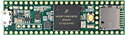
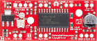

# MicSlider

Microphone X-Y Position Control Program
=======================================
  
Teensy 3.6 with 2 Easy Driver Boards. Targus Numpad connected to USB Host Port of Teensy 3.6.
  
First version simple control of 2 stepper motors to move a microphone on x and y axis.

  
Libraries required
------------------
  
Accelstepper - (http://www.airspayce.com/mikem/arduino/AccelStepper/)
   
USBHost_t36 - USB EHCI Host for Teensy 3.6 - Copyright 2017 Paul Stoffregen

(https://www.pjrc.com/store/teensy36.html) 
  
Teensy 3.6
----------

  
Easy Driver Board
-----------------

  
  
Targus Numpad Function Chart
============================

* 1 - Save Present x,y Position
* 2 - Move Y axis reverse
* 3 - Move to saved x,y Position 
* 4 - Move x axis reverse
* 5 -  
* 6 - Move x axis Forward 
* 7 - Display Current x,y Position
* 8 - Move y axis Forward
* 9 - Move to centre x,y of each axis
* TAB - 
* " / " 
* " * " - Reference x,y to 0,0 position Home
* BACK 
* " - "
* " + "
* ENTER
